# Veterinary hospital database and web application using MySQL and PHP

This project was developed for the Database and Information Systems course. It consists on a web application, in PHP, for querying data stored in the database of a veterinary hospital. One of the main objectives was to use prepared statements in order to avoid SQL injection on the database. The schema is:

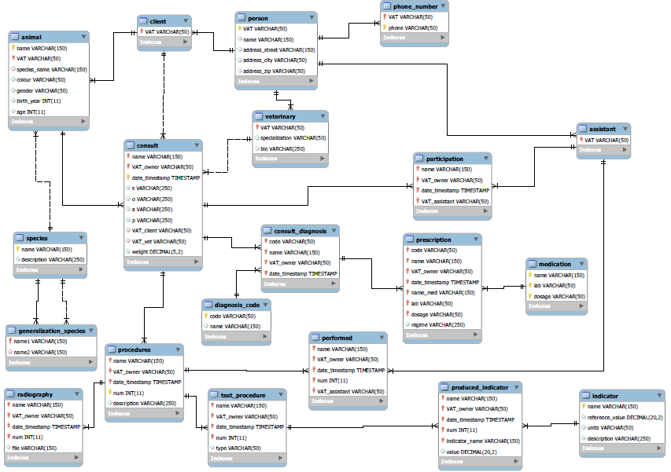

## Requirements

You must have a hosting server with Apache and MySQL servers installed. One possible alternative is to use [XAMPP](https://www.ionos.com/digitalguide/server/tools/xampp-tutorial-create-your-own-local-test-server/).

## Testing 

1) Create a database in the MySQL server using the database_population.sql file inside the sql/ folder. 

2) Run on that database the new_animal_trigger.sql file, which consists on a trigger that automatically calculates the age of a new added animal based on its birthyear.

3) Update the host, user and pass variables inside the functions.php file (lines 6-8) inside the src/ folder based on the credentials of your MySQL server.
```
$host = "";
$user = "";
$pass = "";
```

4) Go to the main page (http://[HOSTNAME]/mainPage.php) inserting the HOSTNAME of your server using your favourite browser.

5) Query for animals named Mimi whose owner VAT is A1:

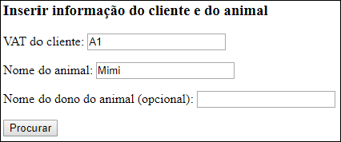

You should find two results:

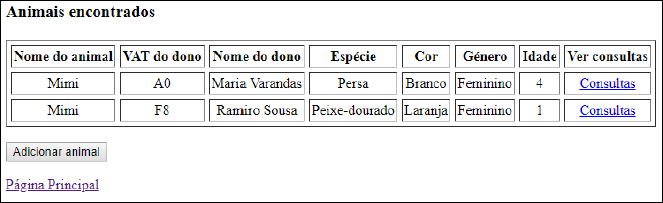

As you can see, there are two animals called Mimi but none of them belong to the owner whose VAT is A1. Hence, you can add a new animal for that owner.

6) Insert a new animal by clicking on the pushbutton:

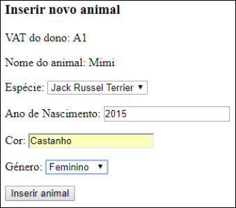

The program automatically inserts the owner VAT and animal name. You can then insert the animal species, birthyear, color and gender. Now, click on the pushbutton for inserting this animal in the database. After that, you will be retrieved to the former page and now it only appears one result, which is the animal you have just inserted. Note you can not a new animal again.

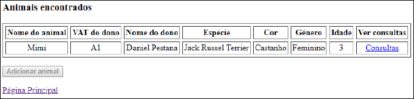

7) Click on the hyperlink below and search for an animal named Rex whose owner VAT is B2. Then, select on the consults' hyperlink of the only result displayed. You should be retrieved with two consults:

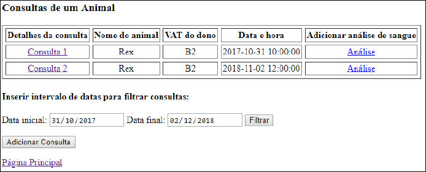

Filter the consults choosing 2018/11/01 as final date. Now only one consult should be displayer:

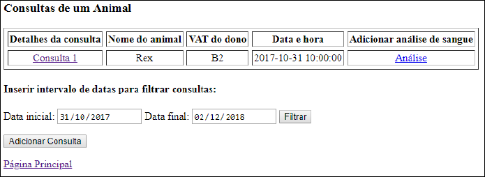

Click on the consult details hyperlink and check the several tables displayed:

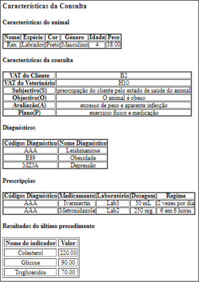

8) Go one page back and add a new consult. Fill all the required fields and select the checkbox to also add a diagnostic. Click on the pushbutton below:

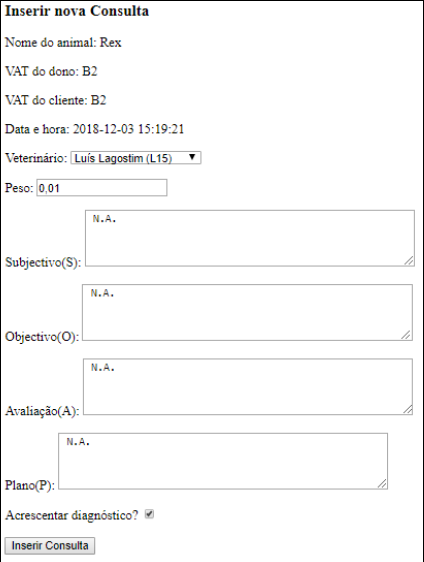

Select a possible diagnostic. Select the checkbox if you want to introduce more diagnostics. Click on the pushbutton below:

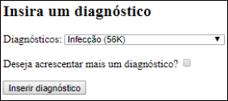

Confirm that the new consult appears:

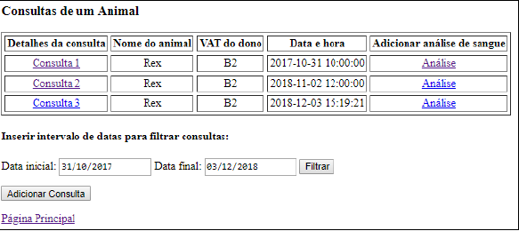

Click on the consult details hyperlink to check that the data was correctly stored:

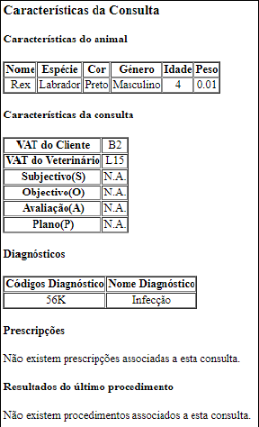

9) Click on the analysis hyperlink of the consult just created to add a new blood analysys. Fill the data on the required fields and click on the pushbutton below:

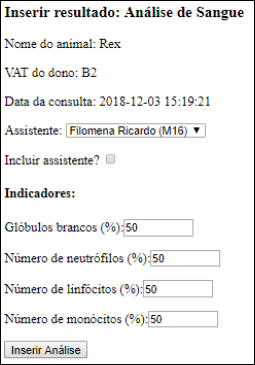

Click on the consult details hyperlink to check that the new analysis data was correctly stored:

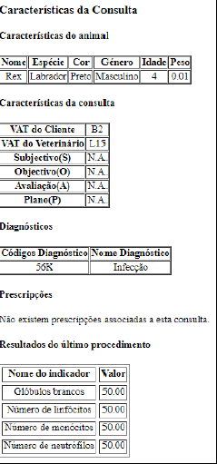